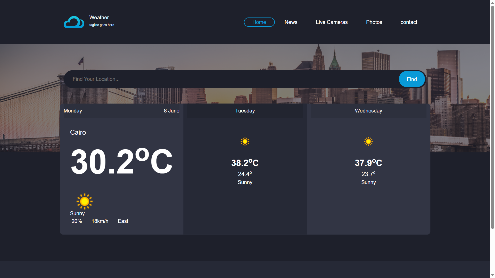

# 🌤️ Weather App

> A professional, responsive weather forecasting web application delivering real-time weather data with a modern UI and smooth user experience.

---

## 📌 About the Project

Weather App is a fully responsive front-end web application that provides real-time weather information for cities worldwide.
It is built with a focus on performance, usability, and clean UI/UX design, showcasing strong front-end development and API integration skills.

This project demonstrates the ability to build production-like web interfaces that consume real-world APIs and present data in a clear, user-friendly format.

---

## 🚀 Features

* 🔍 Global city search with instant weather results
* 🌡️ Real-time temperature, weather conditions, humidity, and wind speed
* 📱 Fully responsive design for all devices (mobile, tablet, desktop)
* ⚡ Fast API response handling and dynamic UI updates
* 🎨 Modern, clean, and intuitive user interface
* 🧠 Well-structured and maintainable codebase
* 🌐 Live weather data integration using external API
* 💡 Smooth user experience with optimized performance

---

## 🛠️ Tech Stack

* HTML5
* CSS3
* Bootstrap 5
* JavaScript (ES6+)
* Weather API (OpenWeather or similar)

---

## 🧠 Architecture & Approach

The application follows a simple but scalable front-end architecture:

* Separation of structure, styling, and logic
* Modular JavaScript functions for API handling
* Responsive design using Bootstrap grid system
* Clean DOM manipulation for dynamic updates
* Error handling for invalid or empty searches

---

## 🎯 Key Highlights

* Built with real-world development practices
* Focus on performance and user experience
* Mobile-first responsive design approach
* Clean and reusable code structure
* API-driven dynamic content rendering

---

## 📸 Screenshots

<p align="center">
  
</p>

---

## 🌐 Live Demo

> 🔗 https://joe-elkilani.github.io/Weather/

---

## 📁 Project Structure

```bash
Weather/
│
├── index.html
├── css/
│   └── style.css
├── js/
│   └── main.js
└── assets/
    └── images/
```

---

## 💡 What I Learned

* Working with real APIs and handling asynchronous data
* Building responsive layouts with Bootstrap
* Improving UI/UX for better user interaction
* Writing cleaner and more maintainable JavaScript code

---

## 📬 Contact

If you'd like to collaborate or discuss opportunities:

* GitHub: https://github.com/joe-elkilani
* Portfolio: (Add your portfolio link)
* Email: (Add your email)

---

> ⭐ If you like this project, feel free to star it on GitHub!
